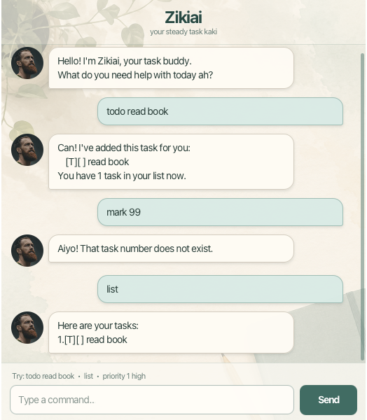

# Zikiai User Guide

Zikiai is a task-management chatbot with a friendly Singaporean personality.
It helps you record todos, deadlines, and events, track their completion, set
priorities, and find tasks. Your changes are saved automatically between
sessions.



## Starting Zikiai

1. Install Java 25.
2. Download the `zikiai.jar` file for your operating system and processor from
   the [latest Zikiai release](https://github.com/zikiai/ip/releases/latest).
3. Put the JAR in its own folder and open a terminal in that folder.
4. Run:

   ```bash
   java -jar "zikiai.jar"
   ```

The released GUI JAR includes platform-specific JavaFX libraries. Use a build
created for your operating system and processor architecture.

## Using the chatbot

Enter a command in the text field, then press **Enter** or select **Send**.
Command words and task numbers must follow the formats below. Extra spaces at
the beginning, end, or between command parts are accepted.

| Action | Command format | Example |
| --- | --- | --- |
| Add a todo | `todo DESCRIPTION` | `todo read book` |
| Add a deadline | `deadline DESCRIPTION /by yyyy-MM-dd` | `deadline submit report /by 2026-09-30` |
| Add an event | `event DESCRIPTION /from START /to END` | `event meeting /from 2pm /to 4pm` |
| Show all tasks | `list` | `list` |
| Find tasks | `find KEYWORD` | `find book` |
| Mark a task done | `mark TASK_NUMBER` | `mark 1` |
| Mark a task not done | `unmark TASK_NUMBER` | `unmark 1` |
| Delete a task | `delete TASK_NUMBER` | `delete 1` |
| Set a priority | `priority TASK_NUMBER LEVEL` | `priority 1 high` |
| Exit Zikiai | `bye` | `bye` |

Task numbers are the numbers shown by `list`. They can change after a task is
deleted, so use `list` again when you need to confirm them.

## Adding tasks

### Todos

Use a todo for a task without a date or time:

```text
todo read book
```

Zikiai adds it as an incomplete todo:

```text
[T][ ] read book
```

### Deadlines

Use a deadline for something that must be completed by a date. Enter the date
in `yyyy-MM-dd` format:

```text
deadline submit report /by 2026-09-30
```

Zikiai checks that the date exists and displays it in a friendlier format:

```text
[D][ ] submit report (by: Sep 30 2026)
```

### Events

Use an event for something that has a start and end. The start and end can
contain words, dates, or times:

```text
event project meeting /from Mon 2pm /to 4pm
```

Zikiai displays it as:

```text
[E][ ] project meeting (from: Mon 2pm to: 4pm)
```

The `|` character cannot appear in task details because Zikiai reserves it for
separating fields in its saved data.

## Viewing and finding tasks

Enter `list` to show every task in its current order:

```text
1.[T][ ] read book
2.[D][ ] submit report (by: Sep 30 2026)
```

Enter `find` followed by a keyword to show tasks whose descriptions contain
that exact, case-sensitive text:

```text
find book
```

Finding tasks does not change or renumber the main task list.

## Updating tasks

Use the number from `list` to update a task. For example:

```text
mark 1
unmark 1
delete 1
```

`[X]` means a task is completed, while `[ ]` means it is not completed.
Deleting a task removes it permanently and renumbers the tasks after it.

## Setting priorities

Set a task to `high`, `medium`, or `low` priority:

```text
priority 1 high
```

The priority appears in the task:

```text
[T][HIGH][ ] read book
```

Clear an existing priority using `none`:

```text
priority 1 none
```

## Saving and loading tasks

Zikiai saves the task list automatically after a task is added, marked,
unmarked, deleted, or reprioritized. It reloads the list the next time it
starts. The data is stored in `data/zikiai.txt` inside the folder from which
you run the application.

Do not edit this file while Zikiai is running. If the saved data is invalid,
Zikiai reports the affected line and disables commands to avoid overwriting
the file.

## Correcting errors

When a recognized command has the wrong format, Zikiai shows the required
format and an example. Invalid commands do not alter the task list, so you can
correct the command and try again safely.

If a task number is rejected, enter `list` to check the current numbers. If a
deadline is rejected, make sure its date uses `yyyy-MM-dd` and represents a
real calendar date.

## Exiting

Enter `bye` to end the session. Zikiai stops accepting new commands, but your
saved tasks remain available the next time you start it.
